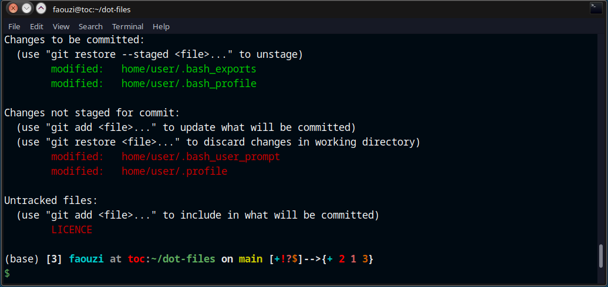

# Dot-files (.*)  

 <p align='left'>
     
 </p>


My personal dot-files in Ubuntu and WSL(on windows)  
<p align="'left">
    
</p>

## Installation

**Warning:** If you want to give these dot-files a try, ***you  should first fork this repository, review the code, and remove things  you don’t want or need***. Don’t blindly use my settings unless you know  what that entails. Use at your own risk!

* You can clone the repository wherever you want.
* The bootstrapper script will pull in the latest version and copy the files to your home folder. using `rsync`

Before install make sure that `rsync` is installed : 

```bash
sudo apt install rsync
```

### Steps

Clone the repository wherever you want or download the repository in zip format.

  ```bash
  git clone git@github.com:faouziMohamed/Dot-files.git
  # Or
  git clone https://github.com/faouziMohamed/Dot-files.git
  ```
  ```bash
  cd Dot-files
  chmod +x bootstrap.sh
  source bootstrap.sh
  ```


  Alternatively, to update while avoiding the confirmation prompt:

  ```bash
  set -- -f; source bootstrap.sh
  ```

## License

This repository is under MIT license

### Feedback 

Suggestions and improvements are [welcome](https://github.com/faouziMohamed/Dot-files/issues)

### Thanks to

* Especially [Mathisbynens](https://github.com/mathiasbynens/dotfiles) dot-files repo and many others.
